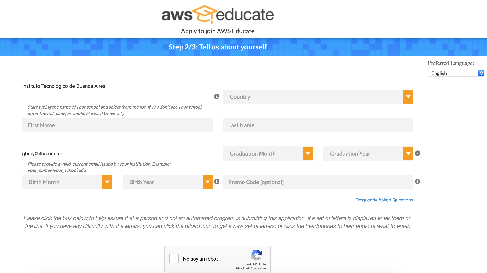
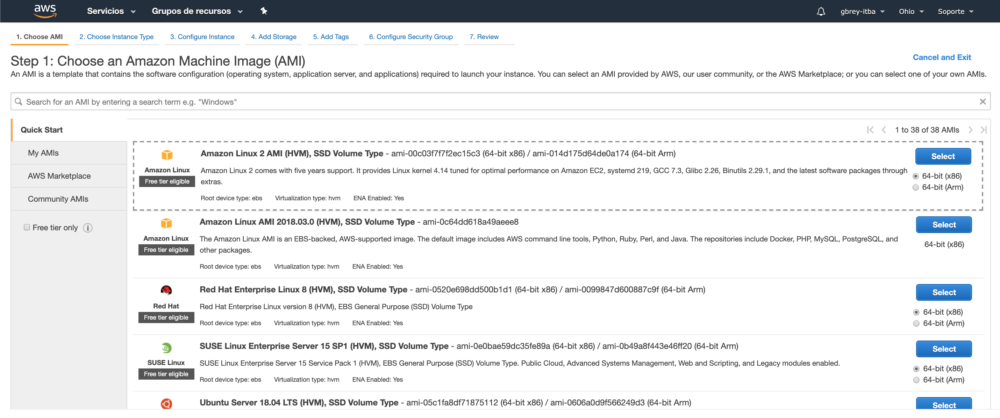
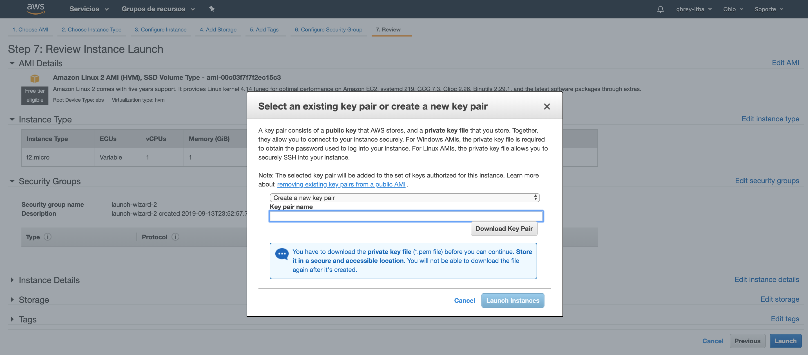
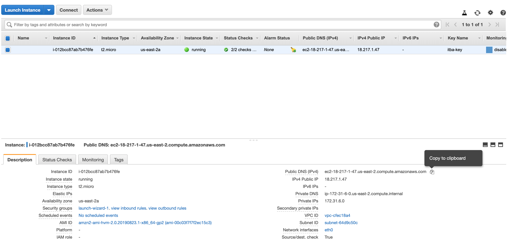
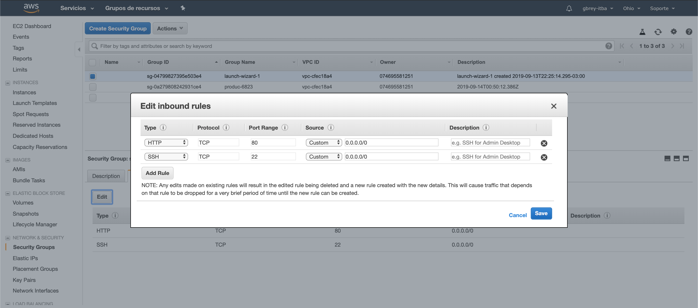
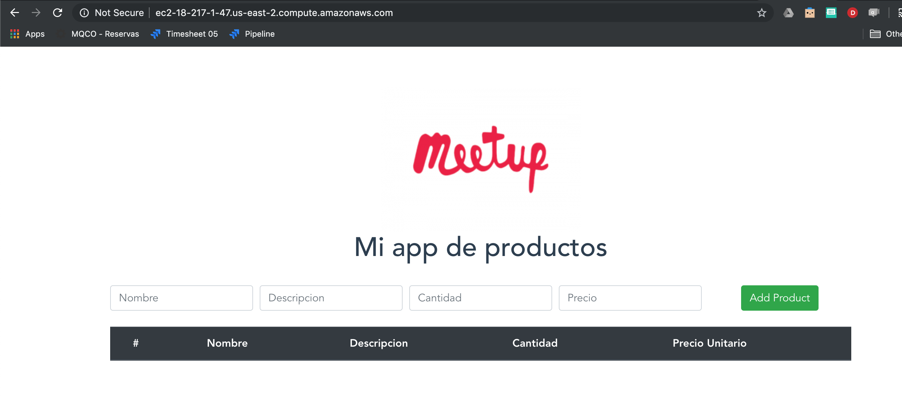

# Practica 4 - Infraestructura Cloud
## Indice

* [1-Setup Student AWS](#1-Setup-Student-AWS)
* [2-Consola / Ohio / Ver VPC](#2-Consola)
* [3-Crear Instancia](#3-Crear-Instancia)
* [4-Bajar Credenciales](#4-Bajar-Credenciales)
* [5-Conectarse a la Instancia](#5-Conectarse-a-la-Instancia)
* [6-Instalar Docker](#6--Instalar-Docker)
* [7-Instalar la images/Imagen de Frontned](#7--Instalar-la-images/Imagen-de-Frontned)
* [8-Exponer la images/Imagen via Security Group](#8--Exponer-la-images/Imagen-via-Security-Group)
* [9-Probar la App](#9--Probar-la-App)


## 1-Setup Student AWS
https://www.awseducate.com/Registration?token=df86d904630595c577b383763253c42d#INFO-Student



## 2-Consola
https://us-east-2.console.aws.amazon.com/console/home?region=us-east-2

## 3-Crear Instancia
https://us-east-2.console.aws.amazon.com/ec2/v2/home?region=us-east-2#Instances:sort=instanceId

### 1- Launch Instance


### 2- Seleccionar "Amazon Linux 2 AMI (HVM), SSD Volume Type"



### 3- Seleccionar "t2.micro"


### 3-Review and Launch 2 veces y Launch

## 4-Bajar Credenciales
Definir un nombre del certificado "itba"


## Bajar Putty y PuttyGen (ambos 64bits)

https://www.chiark.greenend.org.uk/~sgtatham/putty/latest.html

## 5-Conectarse a la Instancia

Obtener la dirección de la isntancia:


Conectarse a la instancia desde el Putty (https://docs.aws.amazon.com/es_es/AWSEC2/latest/UserGuide/putty.html)


## 6- Instalar Docker

Ejecutar el siguiente comando
```
sudo yum install docker
```
Escribir "y" cuando pregunta
Revisar si Docker está instalado
```
sudo service docker start
```
Revisar si Docker está instalado
```
docker version
```

## 7- Instalar la images/Imagen de Frontned
### Pullear la images/Imagen del front (fcatinello/demo-vuejs)
Ejecutar el siguiente comando
```
docker pull fcatinello/demo-vuejs
```
## Correr la images/Imagen del front
Ejecutar el siguiente comando
```
docker run fcatinello/demo-vuejs
```
## Correr Docker PS
Ejecutar el siguiente comando
```
docker ps
```
## 8- Exponer la images/Imagen via Security Group
Navegar a Network Security->Security Group
Seleccionar "launch-wizard-1"
Seleccionar Solapa "Inbound"
Agregar un puerto 80


## 9- Probar la App
Obtener la dirección pública de la images/Imagen
Llamarla desde el Browser

