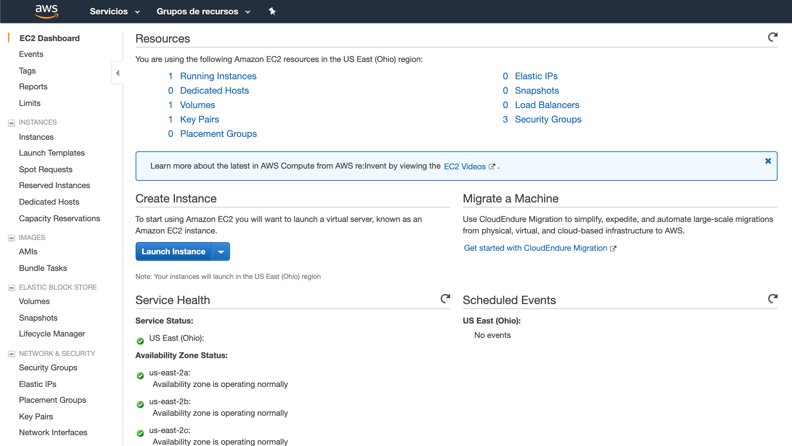
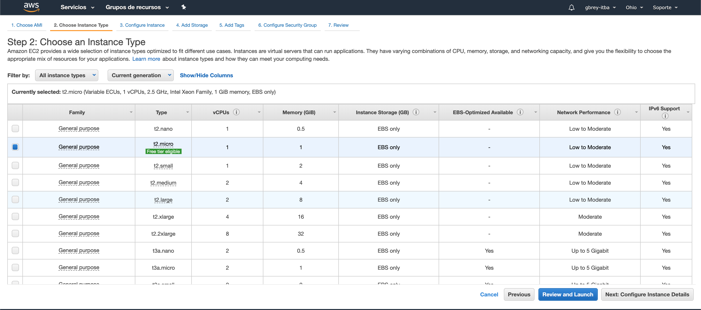
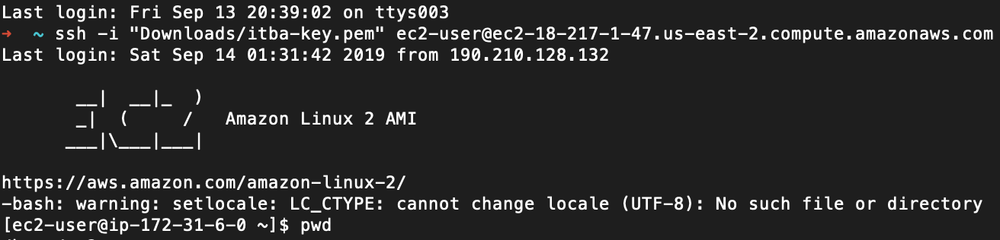
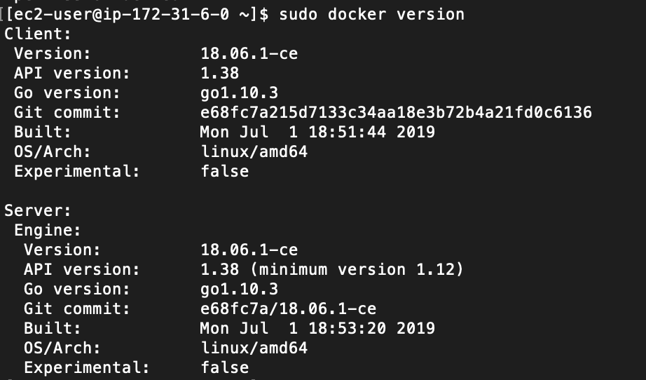

# Practica 4 - Infraestructura Cloud
## 1-Setup Student AWS
https://www.awseducate.com/Registration?token=df86d904630595c577b383763253c42d#INFO-Student


## 2-Consola / Ohio / Ver VPC
https://us-east-2.console.aws.amazon.com/console/home?region=us-east-2
## 3-Crear Instancia
https://us-east-2.console.aws.amazon.com/ec2/v2/home?region=us-east-2#Instances:sort=instanceId

### 1- Launch Instance



### 2- Seleccionar "Amazon Linux 2 AMI (HVM), SSD Volume Type"



### 3-Review and Launch 2 veces

## 4-Bajar Credenciales
Seleccionar la Instancia recien creada y click en el Boton "Connect"

## Instalar Putty

https://putty.org/

## 5-Conectarse a la Instancia
Obtener la dirección de la isntancia:


Conectarse a la instancia desde el Putty (https://docs.aws.amazon.com/es_es/AWSEC2/latest/UserGuide/putty.html)



## 6- Instalar Docker en Instancia
Ejecutar el siguiente comando
```
sudo yum install docker
```
Escubir "y" cuando pregunta
Revisar si Docker está instalado
```
sudo service docker start
```
Revisar si Docker está instalado
```
docker version
```

## 7-Instalar la Imagen de Frontned
### Pullear la Imagen del front (fcatinello/demo-vuejs)
Ejecutar el siguiente comando
```
docker pull fcatinello/demo-vuejs
```
## Correr la imagen del front
Ejecutar el siguiente comando
```
docker run fcatinello/demo-vuejs
```
## Correr Docker PS
Ejecutar el siguiente comando
```
docker ps
```
## 8- Exponer la imagen via Security Group
Navegar a Network Security->Security Group
Seleccionar "launch-wizard-1"
Seleccionar Solapa "Inbound"
Agregar un puerto 80


## 9- Llamar al browser
Obtener la dirección pública de la imagen

Llamar a URL
## Incorporar Cloud Watch